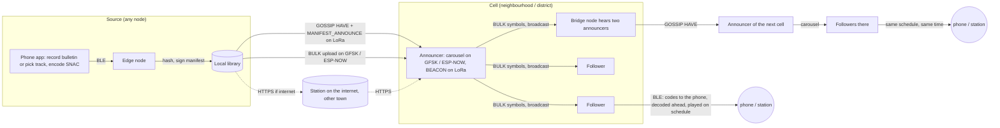

# Architecture

## 1. One protocol, no roles

Every MeshCast node runs the same `core` protocol. There is no "repeater", "client" or "gateway"
setting. What differs is capacity, which the node measures itself and turns into its election
score ([PROTOCOL.md](PROTOCOL.md) §5): a mains-powered box on a roof with a big antenna, lots of
storage and an internet uplink scores high and ends up as the announcer of its cell; a battery
dongle in a pocket scores low and listens. Swap the hardware and the roles swap with it, with no
configuration.

The three hardware shapes that exist today:

| Shape | Hardware | Carriers | Typical outcome |
|---|---|---|---|
| **Edge node** | ESP32-S3 + SX1262: Seeed XIAO ESP32S3 + Wio-SX1262 (8 MB PSRAM), Heltec V3, LilyGo T-series | sub-GHz GFSK + LoRa, ESP-NOW LR, BLE to phone, optional SD; carries audio as codes and does not decode it (§6) | follower or source; announcer in small or offline cells |
| **Station** | Linux (Raspberry Pi / CM4) + RAK2287 (SX1302) in an upcycled Helium miner; or any Linux box with an SX1262/SX1302 | sub-GHz (8-channel LoRa RX, 1 FSK RX, single TX), Ethernet/IP, storage, transcoding | announcer of a district; internet seeder |
| **Phone app** | Android/iOS | BLE to an edge node; optional internet for the node | the human interface: library, subscriptions, playback, microphone |

## 2. What the SX1302 station really adds

The SX1302 receives on eight LoRa channels simultaneously (multi-SF) plus one fast LoRa channel
and **one** GFSK channel, and transmits one frame at a time. So a station:

- hears every source's GOSSIP and MANIFEST_ANNOUNCE across the profile's control channels at
  once, city-wide at SF9–SF12 (10–25 km), which makes it the natural "programme guide" of a region;
- receives one GFSK upload at a time, like any dongle;
- transmits its carousel like any dongle, gated by the same EtherDiscipline budget.

It is not a base station in the cellular sense. It is a node with excellent hearing.

A MeshCast node is dedicated: the station software owns the SX1302 outright, and no other mesh
firmware (Meshtastic, MeshCore, Meshpoint) runs on the same radio. Those projects occupy the same
bands with realtime chat traffic that MeshCast must yield to; sharing a radio with them would
only import their congestion. Interoperation is not a goal. If their scaling problems are ever
solved, bridging can be reconsidered then.

## 3. Data flow

Read it left to right: a human makes content on a phone, which encodes it (PROTOCOL.md §1.1);
the edge node hashes it and signs the channel manifest; the cell's announcer learns about it by gossip and pulls it (or, with internet,
fetches it from a station anywhere); the carousel broadcasts it to every follower; bridge nodes
that hear two announcers carry it to the next cell; every follower's phone decodes its own copy
ahead of time and plays it at the scheduled time. No audio ever crosses the air in real time.

## 4. Implementation stack

Rust everywhere, one Cargo workspace:

| Crate | Target | Contents |
|---|---|---|
| `core` | `no_std`, no allocator assumptions beyond a bounded arena | objects, symbols, manifests (CBOR, Ed25519), frames and parsers, carousel, gossip, announcer election, EtherFatsoen gate, EtherDiscipline accounting, region profiles. No I/O: it consumes events (frame received, timer, RSSI sample) and emits actions (transmit frame, arm timer). |
| `sim` | host | discrete-event simulator driving many `core` instances through modelled radios (path loss with shadowing, capture effect, hidden nodes, per-carrier bit rates from the datasheets), scenario files, metrics export |
| `station` | Linux | `core` + SX1302 via `libloragw` bindings (as ChirpStack Concentratord does) or SX1262 over SPI, object store on disk, SNAC encoding of ingested tracks and decoding for a speaker, HTTPS seeder/fetcher, metrics endpoint |
| `firmware` | ESP32-S3 (`esp-hal`, `embassy`), later nRF52 (`embassy-nrf`) | `core` + SX126x driver (GFSK and LoRa), ESP-NOW and BLE via ESP-IDF bindings where Rust crates fall short, SD/flash object store; no audio decoding (§6) |
| `app` | Flutter or native (later) | BLE, library, recording and SNAC encoding, SNAC decoding ahead of playback |

Why Rust rather than C++ (the language of Meshtastic and MeshCore):

1. Every node parses frames from strangers, unattended, forever. A parser bug in C++ is a crash or
   a remote code execution reachable by radio; in Rust that class of bug does not compile.
2. The simulator must run the code that ships. A `no_std` core crate in a Cargo workspace makes
   that the default rather than a project of its own (compare Meshtastic's portduino).
3. Radio, timers, BLE and storage run concurrently; the compiler catches data races that in C++
   show up as a reboot after three days.

Known costs: the Xtensa target needs the esp-rs toolchain fork (ESP32-S3 is Xtensa; the newer
ESP32-C6/H2 are RISC-V and upstream); the Rust radio ecosystem is thinner than RadioLib
(there is an `sx1262` crate with GFSK 0.6–300 kbit/s, but SX128x and LR11xx support is patchy);
ESP-NOW and BLE are best reached through ESP-IDF FFI. Fallback if Phase 1 shows the toolchain is
not ready: C++ firmware with PlatformIO + RadioLib and a port of `core`; the station and simulator
stay in Rust.

Building blocks: `raptorq` (RFC 6330, `no_std`), `ed25519-dalek`, `blake3`, `chacha20poly1305`,
`minicbor`, `embassy`, `sx1262`.

## 5. Object store

Each node keeps `objects/<short-id>/` with the header, a symbol bitmap and the symbol data, plus
`manifests/<channel-id>/<seq>` and a `follows` list. The same layout is used on flash, on SD and on
a station's disk, so an SD card moved between nodes is a valid import. Eviction: least recently
scheduled first, never the newest manifest of a followed channel.

## 6. Audio

Audio travels as the codes of a neural codec: SNAC 24 kHz for speech (0.98 kbit/s) and SNAC
32 kHz for music (1.88 kbit/s); PROTOCOL.md §1.1 pins both and FEASIBILITY.md §8 has the listening
tests and timings behind the choice. A 3-minute track is 42 kB, a 5-minute bulletin 37 kB.

The codec decides where work happens:

- **Encoding** runs once, at the source: the phone that records a bulletin, or the station that
  ingests a track.
- **Decoding** runs on the device that plays: the phone, or a station with a speaker. It happens
  ahead of playback, when an object completes, and the result is kept as ordinary audio until the
  scheduled time. Real-time decoding is not needed; a Pixel 4a from 2020 decodes music at 0.27×
  real time on one core in a browser, so an hour of music takes under four hours of background
  work on the slowest path measured.
- **Dongles never decode.** An ESP32-S3 has neither the memory (the music decoder has 38.5 M
  parameters) nor the arithmetic for it. A dongle carries the codes as opaque bytes and hands
  completed objects to the phone over BLE.

The decoder weights ship with the app and the station software (77 MB and 26 MB as fp16). The
runtime on the phone is an open choice for Phase 1: onnxruntime is the fastest path measured so
far (FEASIBILITY.md §8.3).

## 7. What is deliberately not here

- No routing layer, no addresses beyond node ids in gossip, no unicast.
- No realtime audio path, not even as an option.
- No configuration beyond region and (optionally) a channel to follow.
